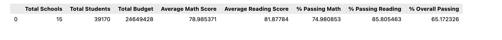
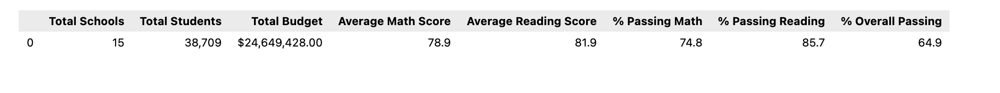

# PyCitySchools District Analysis

# 15 District and charter schools make up the PyCitySchool District

## PyCitySchool.ipynb used all of the math and reading scores from the 15 schools.

## PyCitySchools_Challenge.ipynb excluding all 9th grader scores from Thomas High School (THS) due to suspicion of academic dishonesty.

### The following observations have been made:

  1. The district_summary data from PyCitySchool.ipynb (fully populated) and PyCitySchools_Challenge.ipynb (no 9th grader scores) show insignificant differences for THS. The other 14 schools showed no differences from either script.
  2. The distict summary values showing "% overall passing" of 65% while the minimum passing percentage is 70%. 
  3. The PyCitySchool district has signicant work to do in order to raise % Overall passing to a least the 70% level.  
  4. The first per-school-summary in PyCitySchools_Challenge.ipynb.was incorrect for THS because the full THS total student count was used to calculate the percentages in the per-school-summary in PyCitySchool_Challenge.ipynb even through the 9th grader were purged (see screenshot entitled (Module_4-Challenge_per-school-summary-wrong-THS-StudentCount.)
  5. The second per-school-summary in PyCitySchools_Challenge.ipynb was correct for TGS because the decimated THS total student count was used to calculate the percentages in the per-school summary (see screenshot entitled (Module_4-Challenge_per-school-summary-correct_THS StudentCount.
  6. The per-school-summary from PyCitySchools.ipynb and the correct per-school summary PyCitySchool_Challenge showed insignificant differences.
  7. The scores-per-grade-level, score-per-student-spending, score-per-school-sise, and score-per-school type show slight to no difference from both scripts.
  8. The best performing schools show LOWER levels of per-student-funding (see screenshots showing spending per student.
  9. The best perfoming school had 2000 or fewer students while worst performing schools have over 2000 student (see screenshots showing scores per school size.)
  10. The score per grade levels were very similar across all grades (see screenshots showing scores per grade level.)
  11. The charter school performed significantly better than the district schools (see screenshots showing score per school type.)
  12. Thomas High School is one of the top perfoming schools in the PyCitySchool district.

